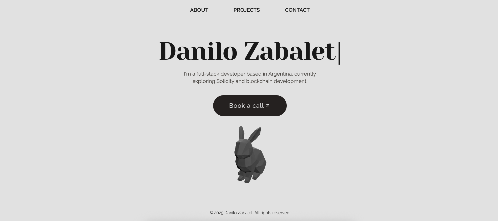
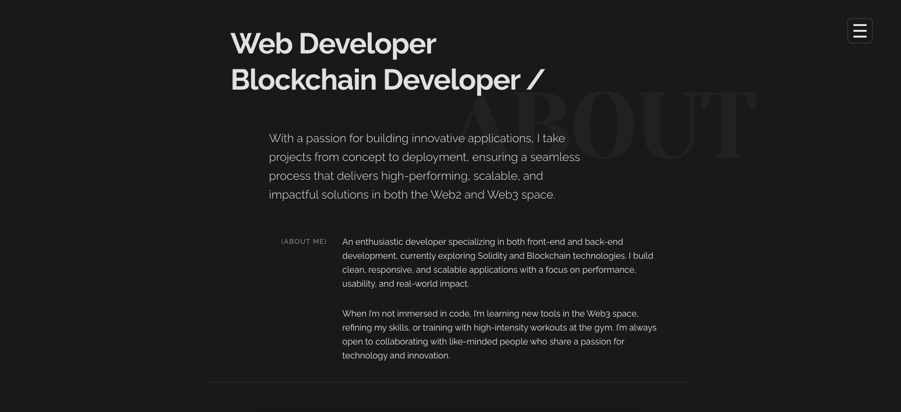
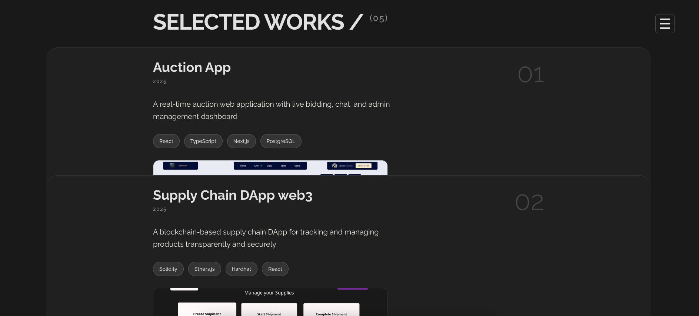

Minimalist Black & White Portfolio
My personal portfolio built with a black & white, minimal aesthetic, smooth animations, and a clean layout to let the work speak for itself.
Designed to be fast, distraction-free, and responsive.

# Screenshots

## ✨ Features
⚪ Black & white design for timeless clarity

🎯 Minimal layout with precise typography

🎥 Smooth background transition animations

🖼️ 3D object integration in the hero section (coming soon)

📱 Fully responsive and mobile-friendly

⚡ Built with Bun for lightning-fast dev experience

## 🛠️ Tech Stack
Bun – package manager & runtime

React – UI library

Tailwind CSS – styling & responsive design

Framer Motion – animations

Three.js / React Three Fiber – for 3D object

## 🚀 Getting Started
bash
# Install dependencies
bun install

# Run the development server
bun dev

# Build for production
bun run build

# Preview production build
bun run preview

📜 License
This project is licensed under the MIT License.
